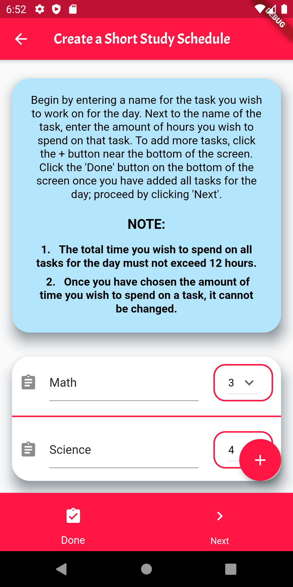
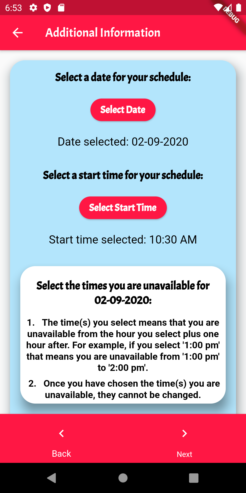
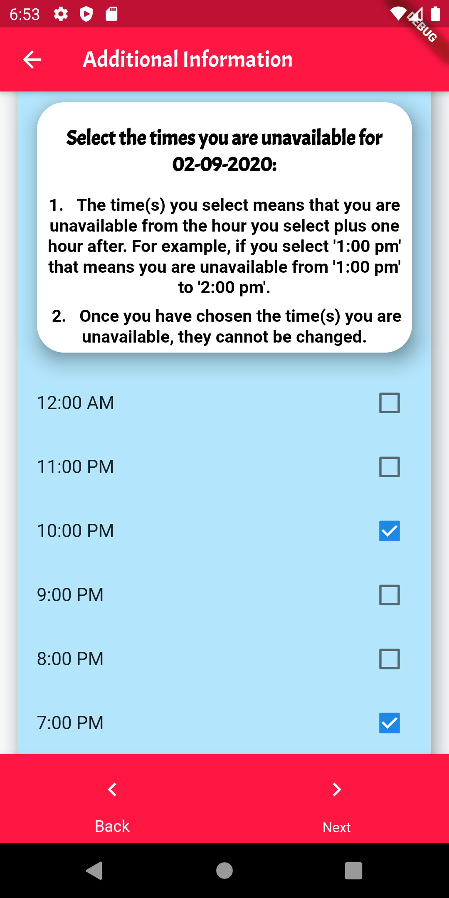
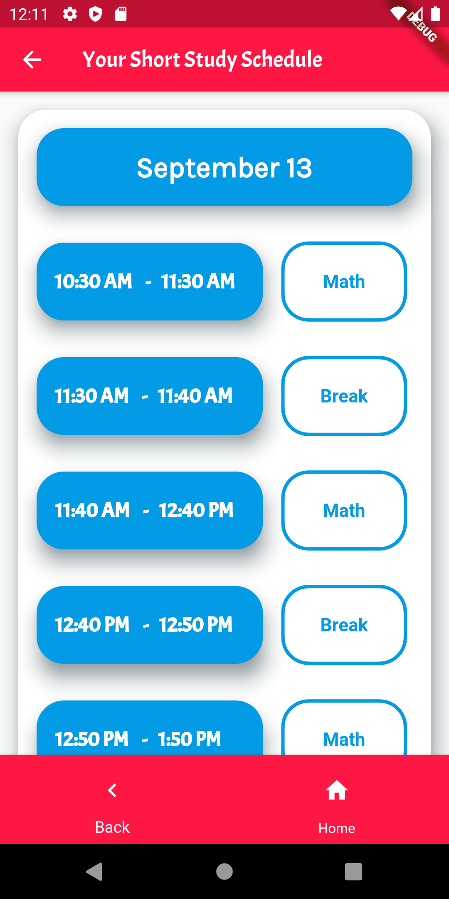
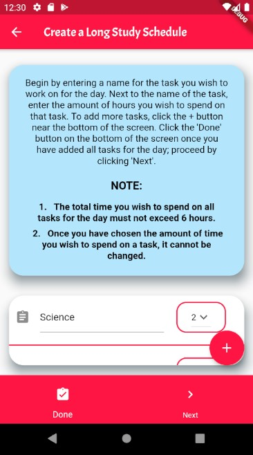
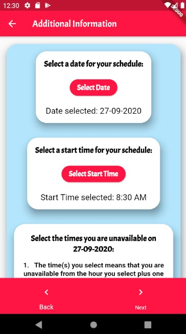
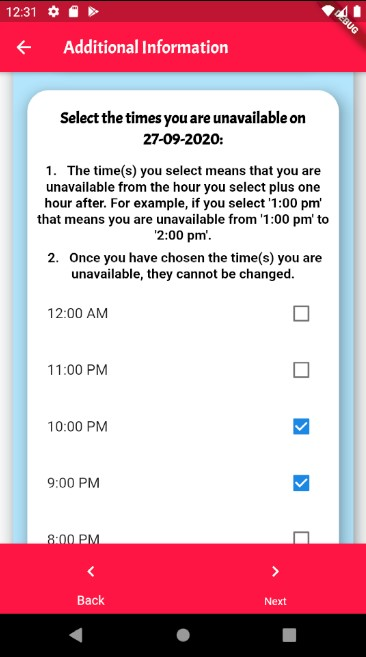
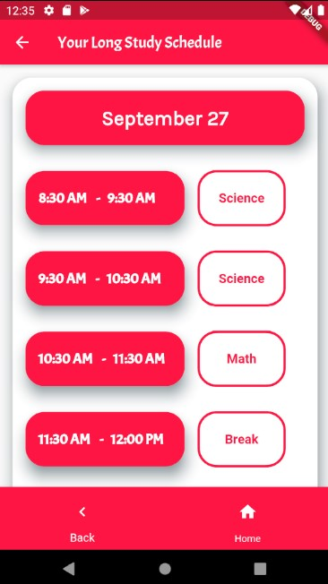
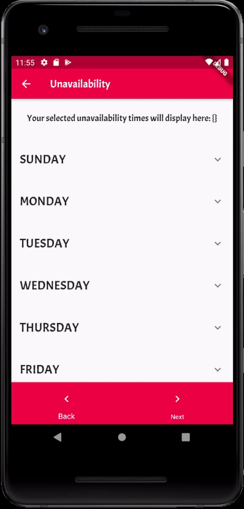

<h1 align="center">PlanPal</h1>

This personal care app is designed to manage work/study schedules efficiently using psychologically certified techniques.

The app features three modes of auto-generated schedules: Non-custom schedules with two types, Longer Periods and Shorter Periods, and a Custom Schedule. The custom and non-custom schedules cannot be modified once they've been generated. The non-custom schedules have restricted timings for studying activities based on the research behind studying for shorter versus longer periods of time. 

The main features of this app include:

1. Auto-generate a personalized schedule that fits to the user’s demands and specifications.

2. Push notifications for reminders about taking a break, starting the next task, hydrating, etc. (currently unimplemented) 

  

<h2 align="center">Table of Contents</h2>

<a href="#features">Features & Functionality</a>

<a href="#installation">Installation Requirements</a>

<a href="#framework">Technical Framework</a>

<a href="#contributors">Contributors</a>

<a href="#notes">Notes</a>

<h2 align="center" id="features">Features & Functionality</h2>
<dl>
  <dt>Short Study Schedule</dt>
  <dd align="center">The Short Study Schedule option allows you to study in multiple 1 hour time intervals with 10 minute breaks. The user input for this schedule consists of the tasks the user would like to work on for the day, the amount of time the user would like to spend per task, the times they are unavailable, a start time as well as a date for the schedule to be generated.
    <table>
      <tr>
        <th>
          
        </th>
        <th>
          
        </th>
        <th>
          
        </th>
        <th>
          
        </th>
      </tr>
    </table>
    
  </dd>
  <dt>Long Study Schedule</dt>
  <dd align="center">The Long Study Schedule generates a schedule for the user that allows them to study in 3 hour blocks with a 30 minute break after each block. The user input for this schedule consists of the tasks the user would like to work on for the day, the amount of time the user would like to spend per task, the times they are unavailable, a start time as well as a date for the schedule to be generated.
  <table>
        <tr>
          <th>
            
          </th>
          <th>
            
          </th>
          <th>
            
          </th>
          <th>
            
          </th>
        </tr>
      </table>
  </dd>
  <dt>Custom Study Schedule</dt>
  <dd align="center">The Custom Study Schedule generates a schedule for the user that allows the user to add in multiple 1 hour activities without pre-added breaks for an auto-generated weekly schedule. The user input for this schedule consists of wake up and bed times to set the day limit, unavailability times, task inputs with time expected to be spent on each task and specific days the task is to be added.
  <table>
        <tr>
          <th>
            
          </th>
          <th>
            
          </th>
          <th>
            
          </th>
          <th>
            
          </th>
        </tr>
      </table>
  </dd>
</dl>

<h2 align="center" id="installation">Installation Requirements</h2>

Before you can run this app, ensure that you have the Flutter SDK and an emulator, such as the Android Emulator set up on your device. See the 
  <a href="https://flutter.dev/docs/get-started/install">Flutter</a> website for more information.

<ol>
  <li>Open up Command Prompt on Windows or Terminal on macOS/Linux.</li>
  <li>Use the <code>cd</code> command to change the directory to the location of the <code>.dart</code> files for this app.</li>
  <li>Use the <code>flutter pub get</code> command to get all dependencies for the app.</li>
  <li>Use the <code>flutter run</code> command.</li>
  <li>Now the app will run on the emulator you have chosen.</li>
</ol>
  

<h2 align="center" id="framework">Technical Framework</h2>

This app was developed using the Android Studio IDE, Flutter SDK and Dart programming language.

<h2 align="center" id="contributors">Contributors</h2>

The entirety of this program was designed and coded by Izba Amjad, Khushi Desai and Harman Khehara.

<h2 align="center" id="notes">Notes</h2>

This app is currently not deployed on the App Store or Google Play.

