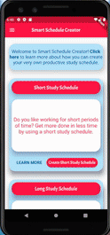

<h1>Smart Schedule Creator</h1>

This personal care app is designed to manage work/study schedules efficiently using psychologically certified techniques.

The app features three modes of auto-generated schedules: Non-custom schedules with two types, Longer Periods and Shorter Periods, and a Custom Schedule. With the exception of the custom schedule, the non-custom schedules cannot be modified once they've been generated. The non-custom schedules have restricted timings for studying activities based on the research behind studying for shorter versus longer periods of time. 

The main features of this app include:

<ol>
  <li>Auto-generate a personalized schedule that fits to the user’s demands and specifications.</li>
  <li>Push notifications for reminders about taking a break, starting the next task, hydrating, etc. </li>
</ol>

  

<h2>Table of Contents</h2>

<a href="#features">Features & Functionality</a>

<a href="#installation">Installation Requirements</a>

<a href="#framework">Technical Framework</a>

<a href="#contributors">Contributors</a>

<a href="#notes">Notes</a>

<h2 id="features">Features & Functionality</h2>

<h2 id="installation">Installation Requirements</h2>

<h2 id="framework">Technical Framework</h2>

<h2 id="contributors">Contributors</h2>

<h2 id="notes">Notes</h2>
